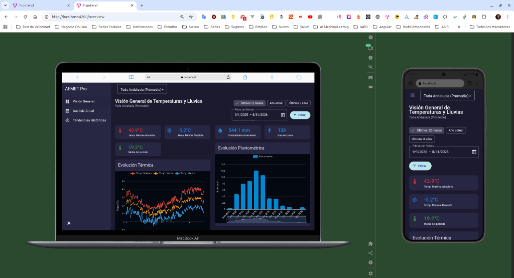
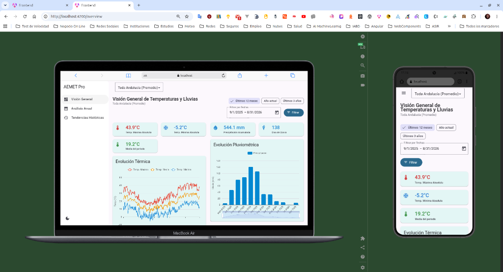
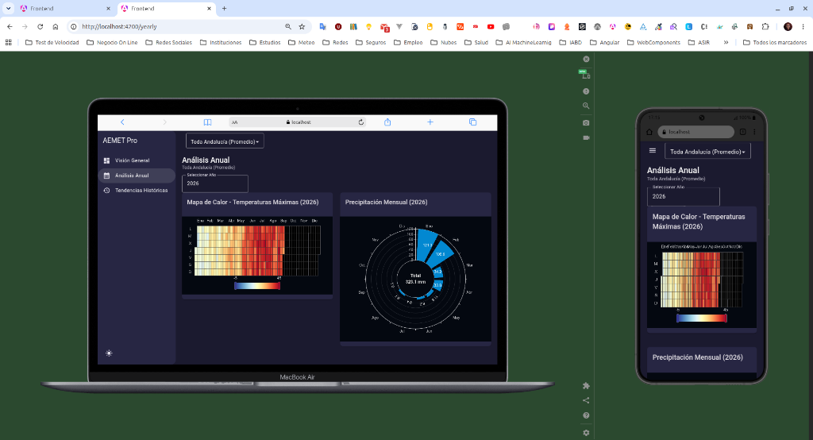
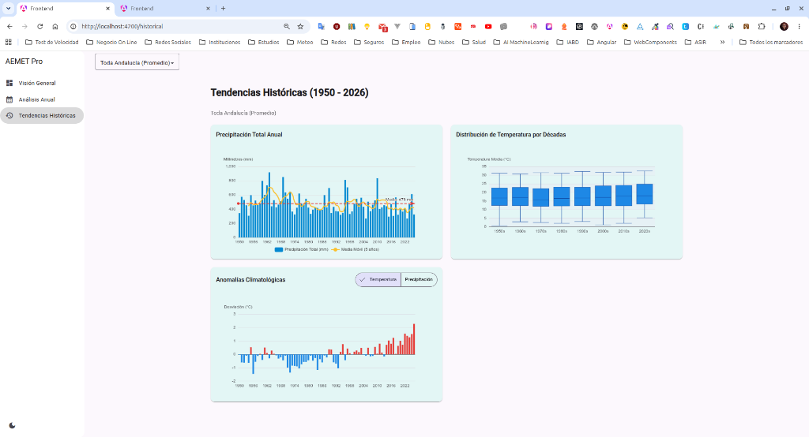
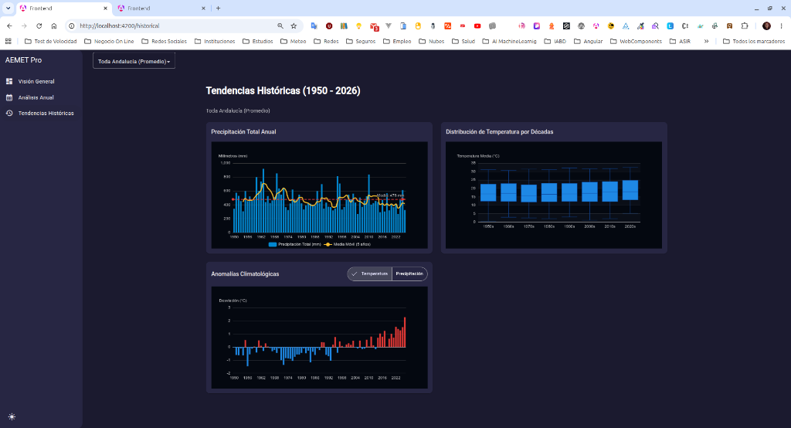
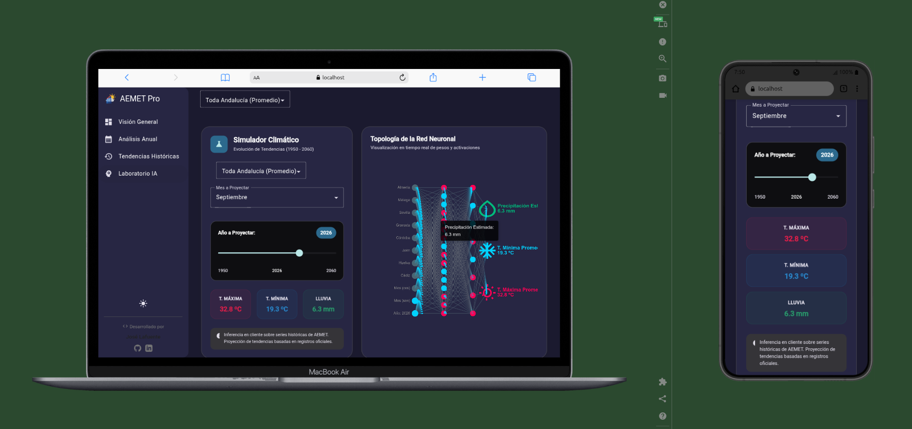

# AEMET Visualizer Pro

<div align="center">
  
  <br><br>
</div>

Bienvenido a **AEMET Visualizer Pro**, una herramienta avanzada para la descarga, procesamiento y visualización interactiva de datos meteorológicos extraídos de la Agencia Estatal de Meteorología (AEMET).

## 🚀 Arquitectura del Proyecto

Este proyecto está construido como un **Monorepo** que aloja dos aplicaciones principales fuertemente tipadas y testeadas:

*   **`backend/`**: Desarrollado en **Python** con **FastAPI** y **SQLModel**.
    *   **Base de Datos Híbrida**: Utiliza **PostgreSQL** (Neon) en entornos de producción y **SQLite** (`weather.db`) para el desarrollo local ágil. para almacenar el histórico meteorológico.
    *   **Reconstrucción de Series Históricas**: El sistema integra rutinas personalizadas de *Data Backfilling* que empalman el histórico de antiguas estaciones meteorológicas clausuradas en los años 60-80 (ej. Jaén, Huelva y Almería antiguas) con las estaciones modernas correspondientes. Esto garantiza un registro continuo, sólido y sin cortes desde el 1 de enero de **1950** en toda la región andaluza.
    *   **Sincronización Pasiva (Lazy Loading)**: El backend incluye un sistema de tareas en segundo plano (`BackgroundTasks`) que contacta con la API de AEMET de forma asíncrona (`httpx`) al recibir peticiones del frontend. Si detecta que faltan meses completos vencidos en la base de datos local, los descarga y actualiza de forma transparente sin penalizar el tiempo de respuesta.
    *   **Calidad**: Sigue los estándares más altos de la industria con inyección de dependencias pura, un **100% de cobertura en tests unitarios** (vía `pytest`) y documentación exhaustiva (Docstrings PEP 257).
*   **`frontend/`**: Aplicación Web **Angular 22** (SPA) que consume la API para presentar el dashboard interactivo. 
    *   **Diseño**: Utiliza **SCSS** con CSS Grid para un diseño panorámico a dos columnas (sin scroll vertical en escritorio) y soporte nativo para **Modo Oscuro**. Recientemente modernizado con diseño semántico de tarjetas, sombras suaves y objetivos táctiles de 48px para máxima accesibilidad.
    *   **Fallback Offline (Resiliencia)**: Incluye volcados estáticos de la base de datos (JSON de 15MB). Si el backend sufre caídas o latencias excesivas, el servicio intercepta el error (`catchError`) y lee directamente de los estáticos locales, garantizando un funcionamiento ininterrumpido a coste cero.
    *   **Gráficos**: Integra **Apache ECharts** (`ngx-echarts`) para visualizaciones avanzadas (Líneas, Heatmap de Calendario, Barras Polares, y simulaciones topológicas neuronales).
    *   **Calidad**: Mantiene una cobertura de pruebas excepcional (+95%) mediante **Vitest** y entornos JSDOM.


## 📸 Galería y Diseño Responsivo

AEMET Visualizer Pro cuenta con una interfaz moderna, responsiva (adaptada a móviles y tablets) y disponible en modos Claro y Oscuro. Diseñada con baja carga cognitiva para facilitar el análisis de datos masivos.

### Modos Claro y Oscuro
<div align="center">
  
  
</div>

### Mapas de Calor y Análisis Anual
<div align="center">
  
</div>

### Detalle de Gráficas (Pantalla Completa)
<div align="center">
  
  
</div>

### Prediction Playground (Inteligencia Artificial)
<div align="center">
  
  <br><br>
  AEMET Visualizer Pro integra un motor de inferencia neuronal nativo en el navegador que permite predecir el clima futuro y visualizar las activaciones de sus capas ocultas en tiempo real.
</div>

## 🌍 Arquitectura de Despliegue (Cloud)

Para garantizar alta disponibilidad y costes cero (Free Tiers), el proyecto se despliega bajo una arquitectura distribuida:
- **Base de Datos (Neon)**: Alojada en un clúster Serverless de PostgreSQL en Europa (Frankfurt).
- **Backend (Render)**: La API de FastAPI se despliega como un *Web Service* ininterrumpido en Render. Esto permite ejecutar las tareas en segundo plano (`BackgroundTasks`) para sincronizar datos con AEMET sin el estricto límite de 10 segundos por petición que imponen los entornos *Serverless*.
- **Frontend (Vercel)**: La SPA de Angular se sirve mediante la red global (CDN) ultrarrápida de Vercel.

## 🛠️ Requisitos Previos

Para ejecutar este proyecto en tu máquina local, necesitarás tener instalado:

*   [Python 3.12+](https://www.python.org/downloads/)
*   [Node.js y npm](https://nodejs.org/) (Versión 18 o superior)
*   [Angular CLI](https://angular.dev/tools/cli) (`npm install -g @angular/cli`)
*   [Git](https://git-scm.com/)

## 💻 Desarrollo del Backend

Para arrancar la API en entorno local:

```bash
cd backend
source .venv/bin/activate
# Instalar dependencias si es la primera vez: pip install -r requirements.txt
fastapi dev main.py
```
El servidor interactivo Swagger estará disponible en `http://127.0.0.1:8000/docs`.

Para ejecutar la suite de pruebas unitarias del backend:
```bash
pytest tests/ --cov=./
```

## 🌐 Desarrollo del Frontend

Para arrancar la interfaz visual en entorno local:

```bash
cd frontend
# Instalar dependencias si es la primera vez: npm install
npm run start
```
El dashboard web estará disponible en `http://localhost:4200`.

Para ejecutar la suite de pruebas unitarias del frontend (Vitest):
```bash
npm run test -- --coverage
```
